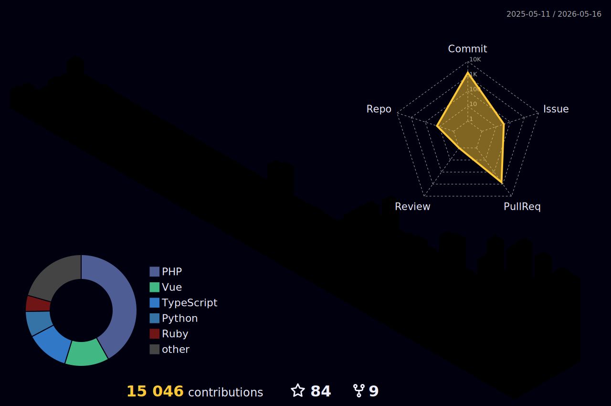

# MPGE

  Hey, I'm Matt. I've been building and shipping software for 14+ years professionally (much earlier as a hobby) across a wide range of stacks and industries. I can honestly say I learned to code the old-school way studying textbooks as a teenager, writing everything out by hand, then testing it later on a computer. It's a completely different landscape now. Things have changed.

  
  
  

  <strong><a href="https://github.com/mpge/awesome-support">Need some support?</a></strong> &middot;
  <strong><a href="https://github.com/mpge/ASeniorDevelopersThoughtsOnVibeCoding">A senior developer's thoughts on vibe coding</a></strong>

---

## 🚀 Flagship Platforms

### Escalated
**[Escalated](https://github.com/escalated-dev/escalated)** is an open-source, embeddable support and ticketing platform built for modern product teams that want enterprise-grade workflows without enterprise drag. A shared Inertia.js UI runs natively inside Laravel, Rails, Django, AdonisJS, and more.

- **Embeddable-first** — drop-in support portals and admin surfaces
- **Workflow intelligence** — SLAs, escalation rules, ownership, and auditability
- **Framework-agnostic** — Laravel, Rails, Django, AdonisJS, WordPress, Filament, and more
- **Flexible deployment** — cloud, self-hosted, or hybrid (cloud / hybrid coming soon)

### Inventoros
**[Inventoros](https://github.com/Inventoros/Inventoros)** is an open-source, modular operations and inventory platform focused on warehouse and fulfillment workflows. It's positioned as a composable operations layer rather than a rigid monolith.

- Workflow-native inventory movements and adjustments
- Integration-first architecture with clean data contracts
- Performance- and scale-aware by design

---

## Areas of interest

<table>
    <tr>
        <td>Escalated ecosystem</td>
        <td><ul>
            <li><a href="https://github.com/escalated-dev/escalated">escalated</a> — the core embeddable support &amp; ticketing platform (Vue 3 + Inertia)</li>
            <li><a href="https://github.com/escalated-dev/escalated-laravel">escalated-laravel</a> — Laravel host plugin</li>
            <li><a href="https://github.com/escalated-dev/escalated-rails">escalated-rails</a> — Ruby on Rails host plugin</li>
            <li><a href="https://github.com/escalated-dev/escalated-django">escalated-django</a> — Django host plugin</li>
            <li><a href="https://github.com/escalated-dev/escalated-adonis">escalated-adonis</a> — full-featured AdonisJS v6 package, TypeScript-native with full type safety</li>
            <li><a href="https://github.com/escalated-dev/escalated-filament">escalated-filament</a> — Filament integration on top of escalated-laravel</li>
            <li><a href="https://github.com/escalated-dev/escalated-wordpress">escalated-wordpress</a> — WordPress port</li>
            <li><a href="https://github.com/escalated-dev/escalated-docs">escalated-docs</a> — public product documentation for escalated.dev</li>
            <li>Public plugins: <a href="https://github.com/escalated-dev/escalated-plugin-community">community</a>, <a href="https://github.com/escalated-dev/escalated-plugin-jira">jira</a>, <a href="https://github.com/escalated-dev/escalated-plugin-marketplace">marketplace</a>, <a href="https://github.com/escalated-dev/escalated-plugin-nps">nps</a></li>
        </ul></td>
    </tr>
    <tr>
        <td>AI Agent Tooling</td>
        <td><ul>
            <li><a href="https://github.com/mpge/ctrlr">ctrlr</a> — control your AI agents like a game controller; a local-first multi-agent orchestrator driven by a USB gamepad</li>
            <li><a href="https://github.com/mpge/look-for-work-claude">look-for-work-claude</a> — proactive codebase analysis plugin for Claude Code that dispatches parallel agents to surface high-impact improvements</li>
            <li><a href="https://github.com/mpge/look-for-work-codex">look-for-work-codex</a> — same idea, ported to Codex CLI</li>
        </ul></td>
    </tr>
    <tr>
        <td>Laravel &amp; PHP</td>
        <td><ul>
            <li><a href="https://github.com/mpge/govel">govel</a> — Go-powered task execution for Laravel; run high-performance jobs as if they were native</li>
            <li><a href="https://github.com/mpge/govel-monitor">govel-monitor</a> — real-time task monitoring dashboard for Govel</li>
        </ul></td>
    </tr>
    <tr>
        <td>Developer Tooling</td>
        <td><ul>
            <li><a href="https://github.com/mpge/code-per-day">code-per-day</a> — GitHub Action that generates beautiful SVG charts of your daily code additions and deletions</li>
            <li><a href="https://github.com/mpge/palettd">palettd</a> — node-based color palette generator with developer-friendly output (drop in your hex codes, get a cool image for your READMEs)</li>
            <li><a href="https://github.com/mpge/git-lost-and-found-finder">git-lost-and-found-finder</a> — finds a lost file from git's lost-and-found</li>
        </ul></td>
    </tr>
    <tr>
        <td>Browser Extensions &amp; Web</td>
        <td><ul>
            <li><a href="https://github.com/mpge/CanRunAds">CanRunAds</a> — JavaScript-based adblocker detection that runs against ad blockers</li>
            <li><a href="https://github.com/mpge/chrome-ad-fallback-screenshot">chrome-ad-fallback-screenshot</a> — Chrome extension for ad agencies to screenshot, resize, compress, and save ad fallbacks</li>
            <li><a href="https://github.com/mpge/chrome-cache-and-cookies">chrome-cache-and-cookies</a> — Chrome extension to refresh a site's cache &amp; cookies with hotkey support</li>
            <li><a href="https://github.com/mpge/resetbrowser">resetbrowser</a> — fix login or loading issues in 30 seconds; clear cookies &amp; cache step-by-step</li>
        </ul></td>
    </tr>
    <tr>
        <td>Curated Lists &amp; Writing</td>
        <td><ul>
            <li><a href="https://github.com/mpge/awesome-support">awesome-support</a> — a curated list of customer and IT support software (paid, free, and open source)</li>
            <li><a href="https://github.com/mpge/DesignReads">DesignReads</a> — collected articles on design and best practices</li>
            <li><a href="https://github.com/mpge/ASeniorDevelopersThoughtsOnVibeCoding">A senior developer's thoughts on vibe coding</a></li>
        </ul></td>
    </tr>
</table>

---

## ✅ 2026 Daily Commit Mission

I'm executing on a daily commit cadence throughout 2026.

  

  

  

  

  

  

---

## 🧰 Core Stack

  
  
  
  
  
  
  
  
  
  
  
  

## 🤝 Collaboration
Always open to collaboration, partnerships, and ambitious builds.

  

